# Semestral Web Apllications Project - Vanilla PHP, JS, HTML, CSS - no frameworks, no external dependencies.
# Uživatelská dokumentace - Game Reviews Platforma

## Dokumentace

- **Automatický generovaná dokumentace** je k dipozici na zwa.toad.cz/~popovego/01/docs/app
- **Uživatelská dokumentace** je dostupná na zwa.toad.cz/~popovego/01/docs/user/docs.md nebo na zwa.toad.cz/~popovego/01/docs/user/docs.pdf
- **Programátorská dokumentace** je dostupná na zwa.toad.cz/~popovego/01/docs/programmer/docs.md nebo zwa.toad.cz/~popovego/01/docs/programmer/docs.pdf. Dale v kodu důležité části a části kde by mohly vzniknout dotazy jsou okomentovány

**Poznámka**: Autodokumentace a programátorské komentáře v kodu jsou napsány v angličtině protože jsem na to zvyklý :D. Jinak, tato dokumentace a programátorská dokumentace je v češtině. Původně byl vytvořen .md soubor, který byl následně konvertován do .pdf pomocí nějakých webových SaaS.

## Úvod

Tato dokumentace popisuje webovou aplikaci pro recenze her, kterou jsem vytvořil jako semestrální projekt. Aplikace umožňuje uživatelům přidávat hry, psát recenze, hodnotit hry a interagovat s recenzemi ostatních uživatelů. Systém má také administrátorský panel pro správu obsahu a uživatelů.

## Obsah

1. [Přehled funkcionality](#přehled-funkcionality)
2. [Uživatelské role](#uživatelské-role)
3. [Autentizace a registrace](#autentizace-a-registrace)
4. [Správa her](#správa-her)
5. [Recenze a hodnocení](#recenze-a-hodnocení)
6. [Uživatelské profily](#uživatelské-profily)
7. [Administrátorský panel](#administrátorský-panel)
8. [Bezpečnostní funkce](#bezpečnostní-funkce)
9. [Technické detaily](#technické-detaily)

---

## Přehled funkcionality

Aplikace je postavena na PHP s použitím MVC architektury. Hlavní funkcionality zahrnují:

- **Správa her**: Uživatelé mohou přidávat nové hry s obálkou, popisem, žánry a platformami
- **Recenze**: Každý uživatel může napsat recenzi na hru s hodnocením 1-10 a komentářem
- **Reakce na recenze**: Uživatelé mohou lajkovat nebo dislajkovat recenze ostatních
- **Moderace**: Administrátoři schvalují nebo zamítají nově přidané hry
- **Uživatelské profily**: Zobrazení her a statistik jednotlivých uživatelů
- **Paginace a řazení**: Seznamy her a recenzí podporují stránkování a různé způsoby řazení

---

## Uživatelské role

Systém rozlišuje tři typy uživatelů:

### Host (nepřihlášený uživatel)
- Může prohlížet aktivní hry
- Může číst recenze
- **Nemůže**: přidávat hry, psát recenze, reagovat na recenze

### Běžný uživatel (role: `user`)
- Všechno co host
- Může přidávat nové hry (které čekají na schválení)
- Může psát a upravovat svoje recenze na aktivní hry
- Může reagovat (lajkovat/dislajkovat) na recenze
- Může smazat své vlastní recenze
- Může vidět svůj profil s vlastními hrami

### Administrátor (role: `admin`)
- Všechno co běžný uživatel
- Přidané hry jsou automaticky aktivní (nečekají na schválení)
- Může schvalovat nebo zamítat hry od ostatních uživatelů
- Může vidět všechny hry včetně těch, které čekají na schválení nebo byly zamítnuty
- Může měnit role uživatelů (udělit/odebrat admin práva)
- Může blokovat a odblokovávat uživatele
- Má přístup k administrátorskému panelu se statistikami

**Důležité**: Zablokovaný uživatel nemůže se znovu přihlásit, dokud ho administrátor neodblokuje.

---

## Autentizace a registrace

### Registrace

Registrace je dostupná na `/register` a vyžaduje následující údaje:

- **Uživatelské jméno**: 
  - Minimálně 3 znaky, maximálně 50 znaků
  - Může obsahovat písmena, čísla, tečky, pomlčky a podtržítka
  - **Nesmí** začínat ani končit tečkou, pomlčkou nebo podtržítkem
  - Musí být unikátní v databázi

- **Email**:
  - Musí být ve validním formátu emailu
  - Část před @ musí mít alespoň 4 znaky
  - Musí být unikátní v databázi

- **Heslo**:
  - Minimálně 8 znaků
  - Musí obsahovat alespoň jedno velké písmeno, jedno malé písmeno, jedno číslo a aspoň jeden speciální znak

- **Potvrzení hesla**:
  - Musí se shodovat s heslem

- **Avatar** (volitelný):
  - Maximální velikost 2MB
  - Musí být obrázek (jpg, png, webp)
  - Pokud není nahrán, bude použít "placeholder" avatar, což je první písmeno uživatelského jména na barevném pozadí

Po úspěšné registraci je uživatel automaticky přihlášen a přesměrován na hlavní stránku.

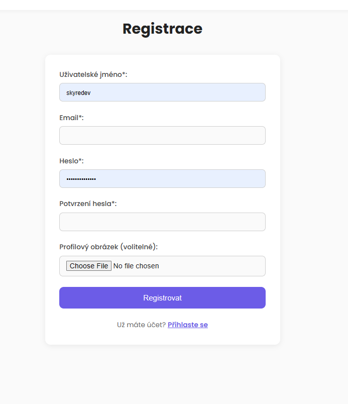

### Přihlášení

Přihlášení je dostupná na `/login`:

- Uživatel se může přihlásit pomocí **uživatelského jména nebo emailu** (pole "identifier")
- Heslo se ověřuje pomocí `password_verify()` hash v databázi
- Systém kontroluje, zda účet není zablokován
- Při neúspěšném přihlášení se zobrazí konkrétní chybová zpráva:
  - "Uživatel s tímto jménem nebo e-mailem nebyl nalezen"
  - "Zadané heslo není správné"
  - "Váš účet byl zablokován. Kontaktujte administrátora."

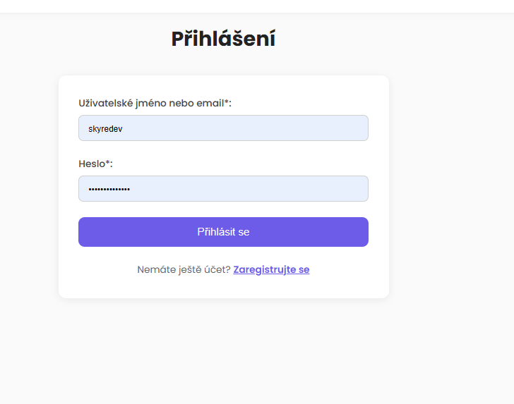

### Odhlášení

Odhlášení je dostupné na `/logout` a vyžaduje, aby byl uživatel přihlášen. Po odhlášení se:
- Vymaže session
- Regeneruje session ID (kvůli bezpečnosti)
- Uživatel je přesměrován na hlavní stránku

---

## Správa her

### Zobrazení her

#### Hlavní stránka (`/` nebo `/home`)

Zobrazuje:
- **Top 10 her**: Seřazené podle průměrného hodnocení (sestupně), pak podle počtu recenzí
- **Poslední přidané**: Nejnovější aktivní hry (10 her)
- Oba seznamy jsou zobrazeny jako karusely s možností posouvání

**Statusy her**:
- `pending` - čeká na schválení (viditelná pouze autorovi a administrátorům, vychozí status pro nové hry od běžných uživatelů)
- `active` - aktivní, viditelná všem uživatelům (výchozí status pro nové hry od administrátorů)
- `rejected` - zamítnutá administrátorem (viditelná pouze autorovi a administrátorům)

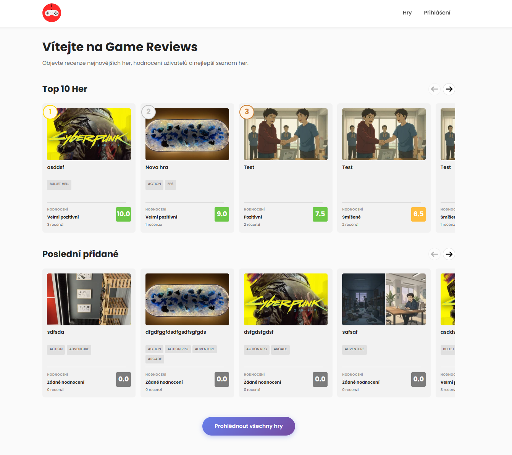

#### Seznam her (`/games`)

- Zobrazuje všechny aktivní hry s paginací (12 her na stránku)
- Podporuje řazení:
  - `rating_desc` - podle hodnocení (nejlepší první) - výchozí
  - `rating_asc` - podle hodnocení (nejhorší první)
  - `date_desc` - podle data přidání (nejnovější první)
  - `date_asc` - podle data přidání (nejstarší první)
  - `title_asc` - podle názvu (A-Z)
  - `title_desc` - podle názvu (Z-A)
- Každá hra zobrazuje:
  - Náhledový obrázek (vertikální thumbnail)
  - Název
  - Průměrné hodnocení
  - Počet recenzí
  - Datum přidání

Při kliknutí na kartičku hry je uživatel přesměrován na detail hry (`/game?id=X`).

**Poznámka**: Datum přídání jak při jeho zobrazení, tak i při řazení vyhráva datum schválení hry administrátorem z tabulky `game_moderations`, pokud záznam pro tuto hru existuje, jinak se použije datum vytvoření hry, to platí pro všechna místa kde je zobrazeno datum přidání hry, či použito pro řazení.

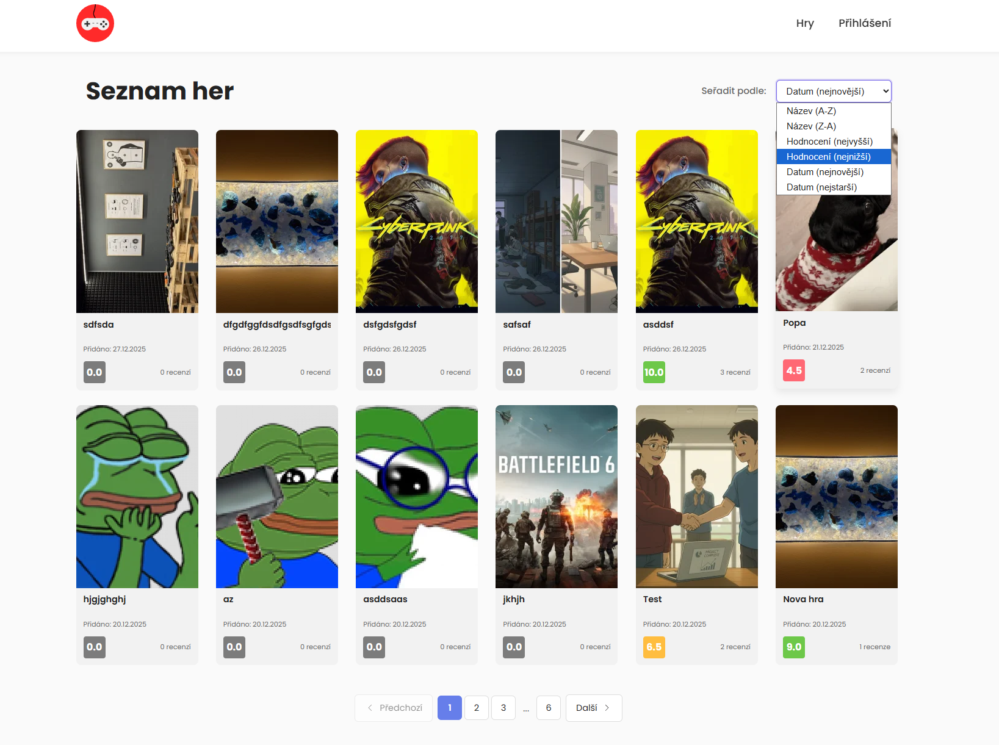

#### Detail hry (`/game?id=X`)

Zobrazuje kompletní informace o hře:
- Plný obrázek obálky
- Název, popis, rok vydání
- Vydavatel a vývojář
- Žánry a platformy
- Průměrné hodnocení a počet recenzí
- Autor hry
- Všechny recenze (nejnovější první)
- Formulář pro přidání/úpravu recenze

**Přístupová práva**:
- Běžní uživatelé vidí pouze aktivní hry (nebo své vlastní hry, které čekají na schválení/zamítnuté)
- Administrátoři vidí všechny hry bez ohledu na status
- Pokud uživatel zkusí přistoupit k neaktivní hře, které není autorem, je přesměrován na `/forbidden`

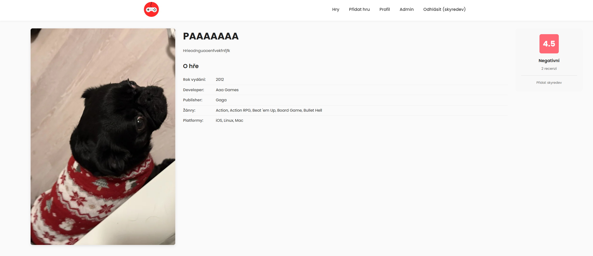
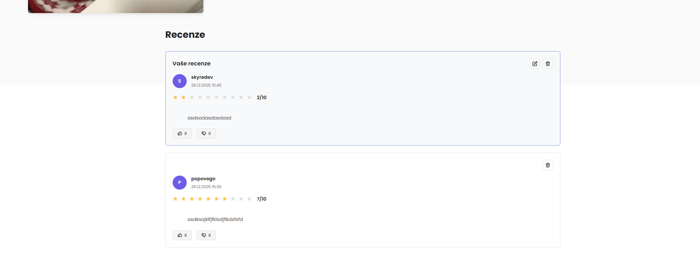

### Přidání nové hry (`/games/create`)

Vyžaduje přihlášení jako běžný uživatel nebo admin.

**Povinná pole**:
- **Název**: 1-255 znaků
- **Popis**: Minimálně 10 znaků
- **Vydavatel**: 1-255 znaků
- **Vývojář**: 1-255 znaků
- **Rok vydání**: Číslo mezi 1980 a aktuálním rokem
- **Žánry**: Alespoň jeden žánr musí být vybrán (z předdefinovaných tagů typu "genre")
- **Platformy**: Alespoň jedna platforma musí být vybrána (z předdefinovaných tagů typu "platform")
- **Obálka hry**: 
  - Povinný obrázek
  - Maximální velikost 5MB
  - Musí být validní obrázek

**Co se stane po odeslání**:
- Obrázek se nahraje a automaticky vytvoří tři verze:
  - `cover_full.webp` - 600x900px (plná velikost)
  - `cover_thumb_vertical.webp` - 200x300px (vertikální náhled)
  - `cover_thumb_horizontal.webp` - 300x170px (horizontální náhled)
- Všechny obrázky se ukládají ve formátu WebP pro optimalizaci
- Obrázky se ukládají do `public/uploads/games/YYYY-MM-DD_ID/`
- Pokud je uživatel **admin**, hra je automaticky aktivní
- Pokud je uživatel **běžný uživatel**, hra má status "pending" a čeká na schválení administrátorem

**Validace**:
- Všechna pole jsou validována na frontendu (JavaScript) i backendu (PHP)
- Pokud validace selže, formulář se zobrazí znovu s chybovými hláškami (PRG)
- Původní hodnoty (kromě obrázku a sensitive polí, což jsou `password`, `password_confirmation` a `csrf_token`) se zachovají v polích

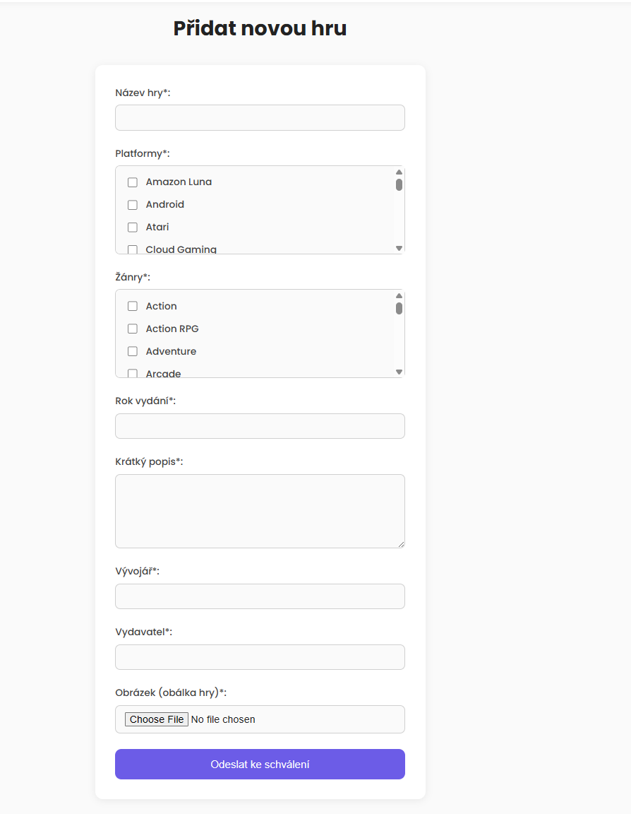

---

## Recenze a hodnocení

### Psaní recenze

Recenzi lze napsat na stránce detailu hry (`/game?id=X`), pokud:
- Uživatel je přihlášen
- Hra je aktivní
- Uživatel ještě nenapsal recenzi pro tuto hru

**Formulář obsahuje**:
- **Hodnocení**: Číslo od 1 do 10 (povinné)
- **Komentář**: Text minimálně 10 znaků (povinný)

**Důležité**:
- Každý uživatel může mít **pouze jednu recenzi** na hru
- Pokud uživatel již má recenzi na hru, zobrazí se jeho stávající recenze
- Recenze se řadí od nejnovějších po nejstarší

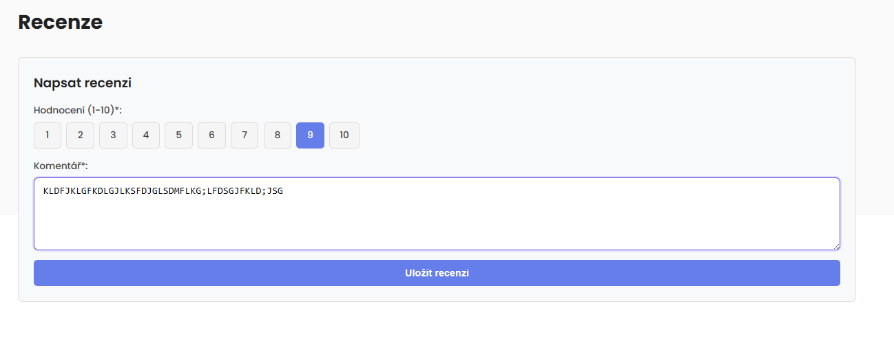

### Úprava recenze

Uživatel může upravit svou recenzi stejným formulářem na stránce detailu hry. Stačí změnit hodnoty a odeslat - systém automaticky pozná, že jde o aktualizaci.

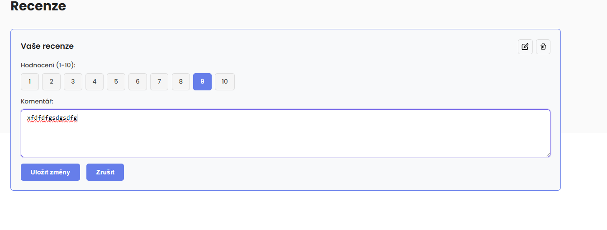

### Mazání recenze

Uživatel může smazat svou vlastní recenzi pomocí ikonky "Smazat" u své recenze. Akce probíhá přes AJAX.

Administrátoři mohou smazat jakoukoliv recenzi.

### Reakce na recenze (Like/Dislike)

Každý přihlášený uživatel může reagovat na recenze ostatních uživatelů:
- **Like**
- **Dislike**

**Jak to funguje**:
- Kliknutí na like/dislike přepne reakci (pokud už máte stejnou reakci, zruší se)
- Pokud má opačnou reakci, změní se na novou
- Reakce se ukládají do databáze v tabulce `review_reactions`
- Počet lajků a dislajků se zobrazuje u každé recenze
- Reakce probíhá přes AJAX

**Omezení**:
- Uživatel může mít pouze jednu reakci na recenzi (buď like, nebo dislike, nebo žádná)

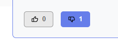

---

## Uživatelské profily

### Zobrazení profilu (`/user?id=X`)

Profil zobrazuje:
- Uživatelské jméno a avatar
- Datum registrace
- Statistiky:
  - Počet přidaných her
  - Počet napsaných recenzí
- Seznam všech her, které uživatel přidal (s paginací, 12 her na stránku)
- Možnost řazení her (stejné jako na `/games` + řazení podle statusu)

**Přístupová práva**:
- Uživatel může vidět pouze svůj vlastní profil
- Administrátoři mohou vidět profily všech uživatelů
- Pokud se pokusíte zobrazit cizí profil jako běžný uživatel, jste přesměrováni na `/forbidden`

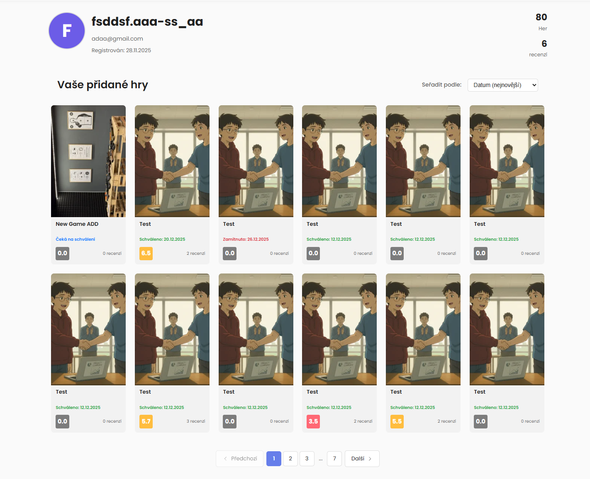

---

## Administrátorský panel

### Hlavní admin stránka (`/admin`)

Zobrazuje:
- **Statistiky**:
  - Celkový počet uživatelů
  - Celkový počet her (všechny statusy)
  - Počet her čekajících na schválení
  - Průměrné hodnocení (podle recenzí, ne her)
  - Celkový počet recenzí

- **Seznam uživatelů** (s paginací, 10 uživatelů na stránku):
  - Uživatelské jméno
  - Email
  - Role (user/admin)
  - Datum registrace
  - Status blokování (Je vidět podle tlačítka "Blokovat" / "Odblokovat", jestli je červené, je uživatel zablokován)
  - Akce:
    - Přepnutí admin role (AJAX, nelze sebe)
    - Blokování/odblokování uživatele (AJAX, nelze sebe)

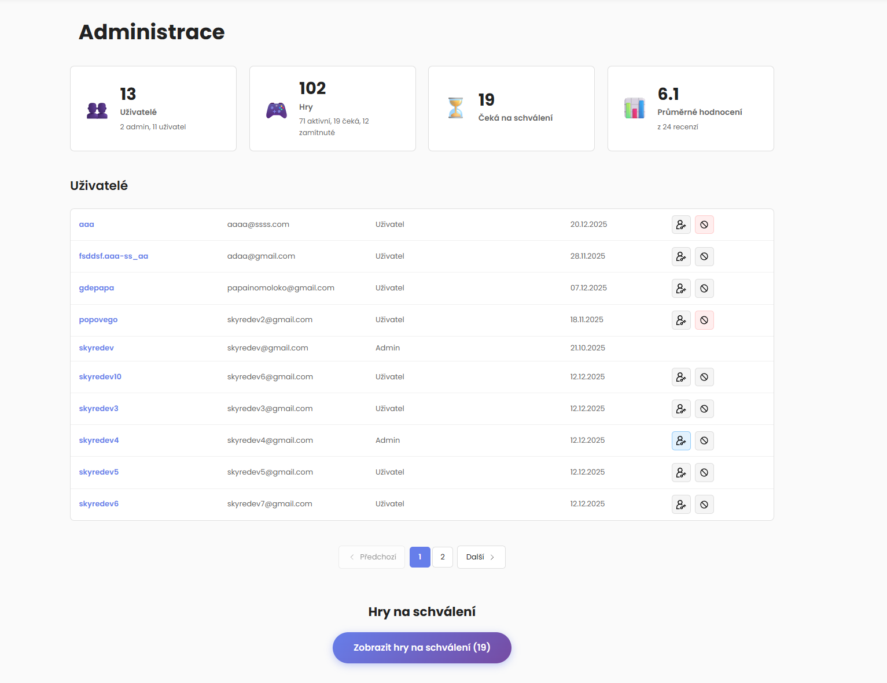

### Hry čekající na schválení (`/pending-games`)

Zobrazuje všechny hry se statusem "pending" s paginací (12 her na stránku).

U každé hry může administrátor:
- **Schválit hru**: Hra se změní na status "active" a je viditelná všem uživatelům, dále jak bylo psáno výše u schválené hry se jako datům vytvoření bude všude používat datum schválení z tabulky `game_moderations`.
- **Zamítnout hru**: 
  - Hra se změní na status "rejected"
  - Může být zadán důvod zamítnutí (volitelné)
  - Autor hry uvidí důvod zamítnutí na stránce detailu hry

**Důležité**:
- Schválení/zamítnutí probíhá přes AJAX
- Po schválení/zamítnutí se hra automaticky odstraní ze seznamu čekajících her
- Informace o schválení/zamítnutí se ukládají do tabulky `game_moderations`

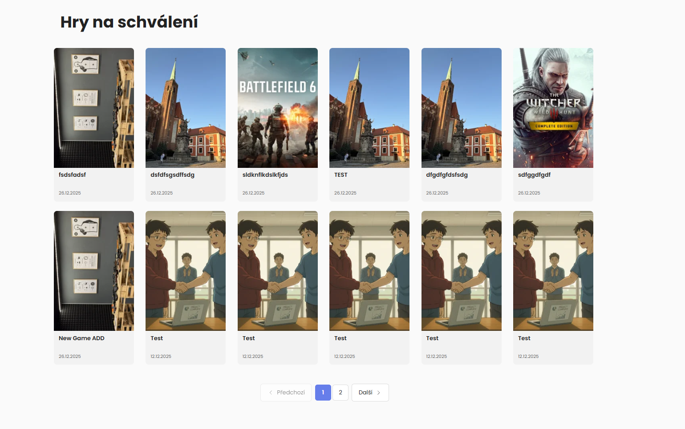
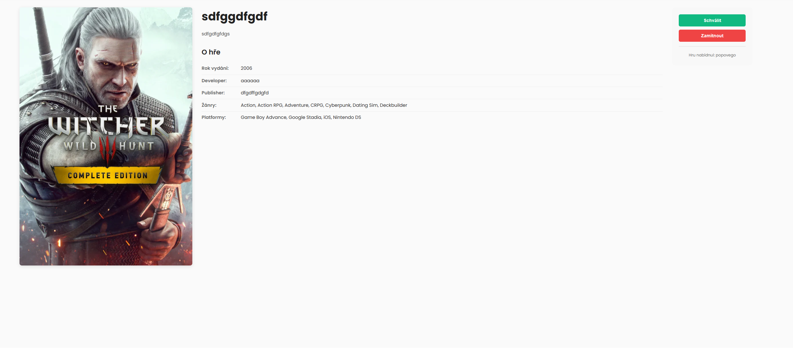
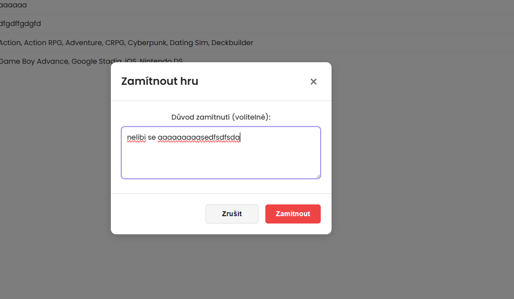
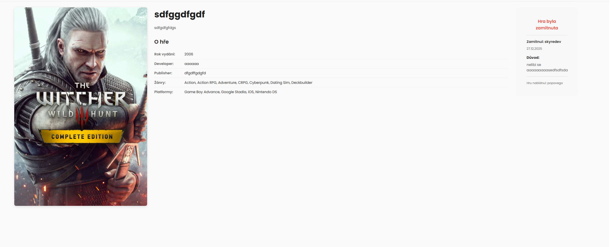

---

## Bezpečnostní funkce

### CSRF ochrana

Všechny POST požadavky (formuláře) jsou chráněny proti CSRF útokům:

- Každý formulář obsahuje skryté pole `csrf_token`
- Token se generuje při načtení stránky a ukládá se do session
- Při odeslání formuláře se token ověřuje
- Pokud token neodpovídá, požadavek je zamítnut a uživatel je přesměrován zpět s chybovou hláškou

**Middleware**: `CsrfMiddleware` kontroluje všechny POST požadavky na chráněných routách.

### Validace vstupů

Všechny uživatelské vstupy jsou validovány:

- **Frontend validace** (JavaScript): Okamžitá zpětná vazba uživateli
- **Backend validace** (PHP Validator třída): Finální kontrola před uložením do databáze

**Validované typy**:
- Povinná pole
- Délka textu (min/max)
- Formát emailu
- Formát uživatelského jména
- Síla hesla
- Validita obrázků
- Velikost souborů
- Hodnoty v rozsahu (např. hodnocení 1-10, rok 1980-současnost)

**Middleware**: `ValidationMiddleware` provádí validaci před zpracováním požadavku.

### Autentizace a autorizace

- Hesla se ukládají jako hash pomocí `password_hash()` s algoritmem PASSWORD_BCRYPT
- Session cookies mají nastavené:
  - `httponly` - JavaScript nemůže přistupovat k cookie
  - `secure` - Cookie se posílá pouze přes HTTPS (pokud je dostupné)
  - `samesite=Strict` - Ochrana proti CSRF
  - Lifetime: 7 dní

**Middleware**: `AuthMiddleware` kontroluje přihlášení a oprávnění:
- `guest` - vyžaduje, aby uživatel **nebyl** přihlášen
- `user` - vyžaduje, aby uživatel **byl** přihlášen
- `admin` - vyžaduje, aby uživatel byl přihlášen a měl roli admin

### SQL Injection ochrana

Všechny databázové dotazy používají **prepared statements** s PDO, což zajišťuje ochranu proti SQL injection.

### XSS ochrana

Všechny výstupy do HTML jsou escapovány pomocí `htmlspecialchars()`.

### Omezení nahrávání souborů

- Obrázky jsou validovány na typ (pouze jpg, png, webp)
- Omezena maximální velikost (2MB pro avatary, 5MB pro obálky her)
- Obrázky se ukládají do specifických složek v public/ directory

---

## Technické detaily

### Architektura

Aplikace používá **MVC (Model-View-Controller)** architekturu:

- **Models** (`app/models/`): Databázové operace a logika
- **Views** (`app/views/`): HTML šablony a prezentace
- **Controllers** (`app/controllers/`): Zpracování požadavků a koordinace mezi modely a views

### Routing

Routing je implementován v `app/includes/router.php`:
- Jednoduchý routing systém
- Cesty jsou definovány v asociativním poli `$routes`
- Každá route má:
  - Controller a metodu (formát: `ControllerName@methodName`)
  - Pole middleware, které se spustí před controllerem

**Příklad route**:
```php
'games/create' => [
    'controller' => 'GamesController@showGamesCreatePage', 
    'middleware' => [new AuthMiddleware('user')]
]
```

### Middleware systém

Middleware jsou třídy implementující `MiddlewareInterface`:
- Spouštějí se v pořadí, v jakém jsou definovány v route
- Každý middleware může:
  - Pokračovat k dalšímu middleware/controlleru (volání `$next()`)
  - Přerušit a přesměrovat (např. při neúspěšné autentizaci)

**Dostupné middleware**:
- `AuthMiddleware` - kontrola přihlášení a rolí
- `CsrfMiddleware` - ochrana proti CSRF
- `ValidationMiddleware` - validace formulářů

### Databázová struktura

Hlavní tabulky:
- `users` - uživatelé
- `games` - hry
- `reviews` - recenze
- `review_reactions` - reakce na recenze
- `tags` - tagy pro žánry a platformy
- `game_tags` - vztah mezi hrami a tagy
- `game_moderations` - historie moderace her

### Session management

- Session se spouští v `config.php`
- Uživatelská data se ukládají v `$_SESSION['user']`:
  - `id` - ID uživatele
  - `username` - uživatelské jméno
  - `role` - role (user/admin)
  - `is_blocked` - zda je účet zablokován

### Flash messages

Systém používá flash messages pro zobrazení chyb a úspěšných zpráv:
- Chyby se ukládají do session pod klíčem `{prefix}_errors`
- Staré hodnoty formulářů se ukládají pod `{prefix}_old`
- Po zobrazení se automaticky vymažou (PRG pattern - Post-Redirect-Get)

### Paginace

Paginace je implementována jako služba v `app/includes/services/pagination.php`:
- Udržuje stav paginace v session (např. při přesměrování zpět)
- Podporuje různé parametry řazení
- Každá stránka má svůj vlastní klíč v session pro nezávislý stav

### Obrázky

- Obrázky se ukládají do `public/uploads/`
- Avatary: `public/uploads/avatars/`
- Obálky her: `public/uploads/games/YYYY-MM-DD_ID/`
- Všechny obrázky se konvertují do WebP formátu pro optimalizaci
- Automatické vytváření různých velikostí pro obálky her (full, thumb_vertical, thumb_horizontal)

### AJAX endpointy

Některé akce probíhají přes AJAX:
- `/api/review/delete` - smazání recenze
- `/api/review/reaction` - like/dislike recenze
- `/api/admin/game/approve` - schválení hry
- `/api/admin/game/reject` - zamítnutí hry
- `/api/admin/user/toggle-admin` - změna admin role
- `/api/admin/user/toggle-block` - blokování/odblokování uživatele

Všechny AJAX endpointy vracejí JSON odpovědi.

### Konfigurace

Aplikace používá `.env` soubor pro konfiguraci:
- `DB_HOST` - host databáze
- `DB_NAME` - název databáze
- `DB_USER` - uživatel databáze
- `DB_PASS` - heslo databáze
- `APP_DEBUG` - zapnutí/vypnutí debug módu
- `APP_BASE` - základní URL aplikace
